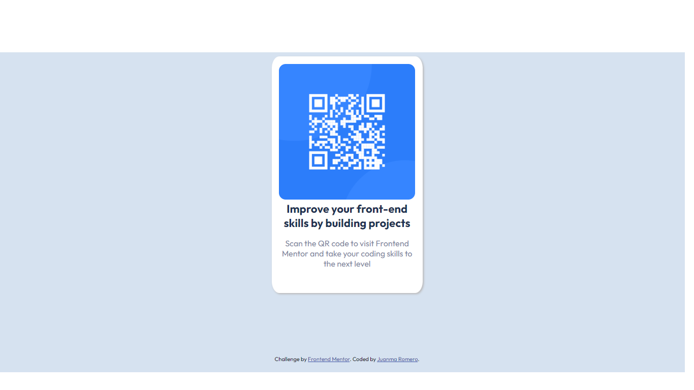

# Frontend Mentor - QR code component solution

This is a solution to the [QR code component challenge on Frontend Mentor](https://www.frontendmentor.io/challenges/qr-code-component-iux_sIO_H). Frontend Mentor challenges help you improve your coding skills by building realistic projects. 

## Table of contents

- [Overview](#overview)
  - [Screenshot](#screenshot)
  - [Links](#links)
- [My process](#my-process)
  - [Built with](#built-with)
  - [What I learned](#what-i-learned)
- [Author](#author)

## Overview

### Screenshot

### Links

- Solution URL: (https://github.com/juanma-romero/qr-code-component-main)
- Live Site URL: (https://juanma-romero.github.io/qr-code-component-main/)

## My process

### Built with

- Semantic HTML5 markup
- CSS custom properties
- Flexbox
- CSS Grid

### What I learned

It was more practice than learning, but it was useful anyway

## Author

- Website - [Juanma Romero](https://github.com/juanma-romero)
- Frontend Mentor - [@juanma-romero](https://www.frontendmentor.io/profile/juanma-romero)
- Twitter - [@Juanma_romerox](https://www.twitter.com/Juanma_romerox)

